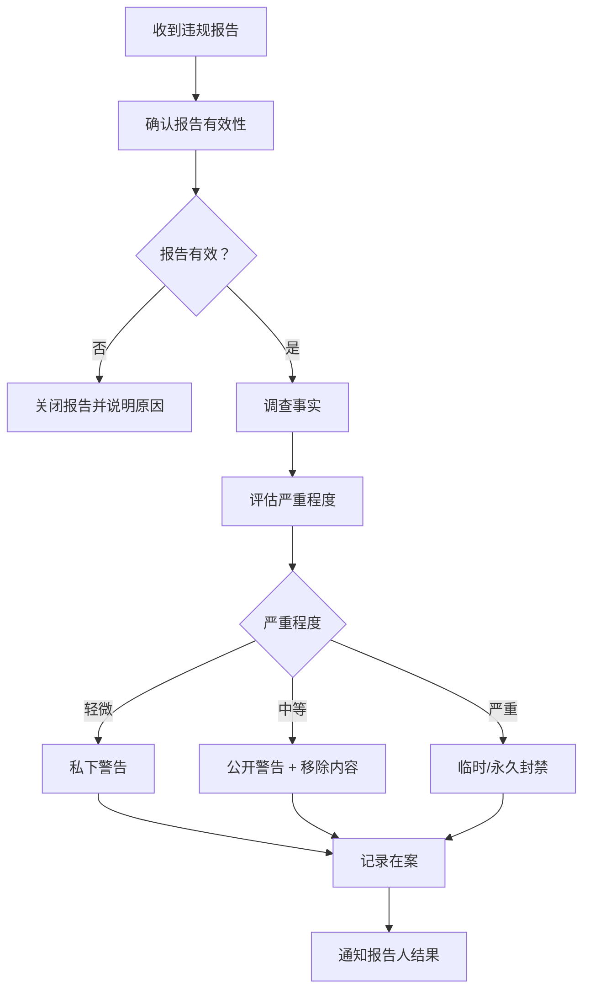

# 📜 行为准则 | Code of Conduct

> **NetSight Pro** - 共建包容、尊重、友善的开源社区

**版本**: 1.0 | **最后更新**: 2026-06-12 | **生效日期**: 2026-06-12

---

## 📋 目录

- [我们的承诺](#-我们的承诺)
- [适用范围](#-适用范围)
- [行为标准](#-行为标准)
- [执行责任](#-执行责任)
- [报告流程](#-报告流程)
- [处理流程](#-处理流程)
- [申诉流程](#-申诉流程)
- [署名与来源](#-署名与来源)

---

## 🤝 我们的承诺

为了营造一个开放、热情、多元化、包容且健康的社区环境，作为贡献者和维护者，我们承诺：

**无论年龄、体型、身体条件、民族、性别特征、性别认同和表达、经验水平、教育程度、社会经济地位、国籍、外貌、种族、宗教或性取向如何**，参与我们的项目和社区的每个人都不会受到骚扰。

我们致力于：

| 承诺 | 说明 |
| :--- | :--- |
| 🌈 **包容尊重** | 创造一个让所有参与者都感到受欢迎的社区 |
| 🗣️ **开放沟通** | 鼓励建设性、有理有据的技术讨论 |
| 🤲 **互帮互助** | 新手和经验丰富的开发者互相学习 |
| 🕊️ **和平解决** | 通过沟通和平解决分歧 |
| 🛡️ **零容忍** | 对骚扰、歧视等行为零容忍 |

---

## 📍 适用范围

本行为准则适用于：

### 1. 项目空间

| 空间 | 说明 |
| :--- | :--- |
| **GitHub 仓库** | Issues、Pull Requests、Discussions、Wiki |
| **代码提交** | 提交信息、代码注释 |
| **文档** | README、SECURITY、CONTRIBUTING 等 |

### 2. 公共空间

| 空间 | 说明 |
| :--- | :--- |
| **社区活动** | 线上/线下社区活动、会议 |
| **社交媒体** | 提及项目的 Twitter、Discord、Slack 等 |
| **其他平台** | 任何代表项目的公开交流 |

### 3. 代表行为

当使用项目官方电子邮件、官方社交媒体账号，或在线上/线下活动中担任指定代表时，本准则同样适用。

---

## ✅ 行为标准

### 积极行为 ✅

| 行为 | 示例 |
| :--- | :--- |
| **使用欢迎语言** | "你好"、"感谢"、"很高兴看到你的贡献" |
| **尊重不同观点** | "我理解你的方法，不过我们可以考虑另一种方案" |
| **优雅接受批评** | "谢谢你的反馈，我来改进一下" |
| **关注社区利益** | 分享知识、帮助新手、优先考虑项目整体质量 |
| **表达同理心** | 理解他人的工作难度和时间限制 |
| **建设性反馈** | 提出具体、可执行的改进建议 |

### 不可接受行为 ❌

| 行为 | 说明 | 示例 |
| :--- | :--- | :--- |
| **暴力威胁** | 威胁他人人身安全 | "如果你不改，我就..." |
| **歧视言论** | 基于身份特征的攻击 | 针对种族、性别、宗教的侮辱 |
| **骚扰** | 不受欢迎的注意或接触 | 反复发送私信、不当玩笑 |
| **性骚扰** | 性暗示语言或图像 | 不当笑话、色情内容分享 |
| **人身攻击** | 针对个人的侮辱性言论 | "你的代码真烂" |
| **网络跟踪** | 跨平台追踪骚扰 | 在不同平台持续骚扰同一人 |
| **恶意举报** | 虚假举报浪费资源 | 明知不实仍举报 |
| **泄露隐私** | 未经许可分享他人信息 | 公开他人真实姓名、地址 |
| **破坏行为** | 故意破坏项目 | 提交恶意代码、破坏 CI/CD |
| **其他不道德行为** | 违反社区准则的行为 | 视具体情况而定 |

---

## ⚖️ 执行责任

### 项目维护者的责任

项目维护者有责任：

| 责任 | 说明 |
| :--- | :--- |
| **澄清标准** | 明确可接受和不可接受的行为 |
| **公正执行** | 对被禁止的行为采取适当、公平的纠正措施 |
| **删除内容** | 删除不符合准则的评论、提交、代码、编辑 |
| **封禁账户** | 对严重违规者临时或永久封禁 |
| **解释原因** | 在采取行动时提供合理的解释 |

### 执行原则

| 原则 | 说明 |
| :--- | :--- |
| **公正性** | 对所有参与者一视同仁 |
| **透明度** | 在合理范围内公开处理结果 |
| **比例原则** | 处理方式与违规严重程度匹配 |
| **教育优先** | 对初犯者以教育和警告为主 |
| **保护受害者** | 优先保护受害者的安全和尊严 |

---

## 📢 报告流程

### 报告渠道

| 渠道 | 方式 | 响应时间 | 加密 |
| :--- | :--- | :--- | :--- |
| **GitHub Issues** | [创建 Issue](https://github.com/BlueDriftHK/CF-workers-netdiag/issues) | 48 小时 | ❌ |
| **电子邮件** | 通过 GitHub 联系 | 72 小时 | ⚠️ |
| **私信** | 联系项目维护者 | 48 小时 | ⚠️ |

### 报告内容要求

请提供以下信息以便我们快速响应：

```markdown
## 行为准则违规报告

### 基本信息
- **违规发生时间**：YYYY-MM-DD HH:MM:SS
- **违规发生地点**：[GitHub Issue/PR/Discussion/其他]
- **违规者用户名**：@username

### 违规描述
[详细描述发生了什么事]

### 违规内容证据
- 链接：[提供具体链接]
- 截图：[如有，提供截图]
- 引用：[复制违规内容]

### 受影响方
[描述谁受到了影响以及如何受到影响]

### 期望的处理方式
[你希望如何处理这个问题]

### 你的联系方式
[可选，用于后续沟通]
```

### 保密承诺

- 所有报告将被**保密处理**
- 只有必要的维护者可以查看报告
- 不会公开泄露报告人身份
- 如有法律要求，可能需要披露

---

## ⚙️ 处理流程

### 违规处理流程



### 处理措施

| 违规级别 | 示例行为 | 处理措施 |
| :--- | :--- | :--- |
| **0 - 轻微** | 无意中使用不当语言 | 私下警告 + 教育 |
| **1 - 一般** | 重复轻微违规、轻度人身攻击 | 公开警告 + 移除违规内容 |
| **2 - 严重** | 严重人身攻击、歧视言论 | 临时封禁（7-30天） |
| **3 - 极严重** | 暴力威胁、性骚扰、恶意破坏 | 永久封禁 + 报告 GitHub |

### 记录保存

- 所有违规报告将被记录在案
- 记录保存期限：**2 年**
- 记录内容包括：时间、违规者、违规类型、处理措施
- 记录仅限维护者查看

---

## 🔄 申诉流程

### 申诉权利

如果你认为处理决定不公平，可以提出申诉：

| 步骤 | 说明 | 时限 |
| :--- | :--- | :--- |
| **1. 提交申诉** | 通过申诉渠道提交申诉请求 | 收到决定后 14 天内 |
| **2. 申诉审查** | 由未参与原处理的维护者审查 | 7 天内 |
| **3. 最终决定** | 作出维持、修改或撤销原决定的裁决 | 14 天内 |

### 申诉渠道

```markdown
## 申诉请求

### 基本信息
- **原报告编号**：[如有]
- **原处理决定**：[描述]
- **申诉理由**：[为什么你认为决定不公平]
- **期望结果**：[你希望如何修改决定]

### 补充证据
[提供任何新的证据]

### 你的联系方式
[用于通知申诉结果]
```

### 申诉原则

- 申诉由**独立**的维护者处理
- 申诉过程**透明**但不公开
- 申诉决定为**最终决定**

---

## 📚 署名与来源

### 来源

本行为准则改编自 [Contributor Covenant][homepage] 2.1 版本，并参考了多个开源社区的优秀实践。

- [Contributor Covenant 2.1](https://www.contributor-covenant.org/version/2/1/code_of_conduct.html)
- [GitHub Community Guidelines](https://docs.github.com/en/site-policy/github-terms/github-community-guidelines)
- [Django Code of Conduct](https://www.djangoproject.com/conduct/)
- [Rust Code of Conduct](https://www.rust-lang.org/policies/code-of-conduct)

### 贡献者公约

```markdown
项目维护者有权利和责任删除、编辑或拒绝不符合本行为准则的
评论、提交、代码、wiki编辑、问题和其他贡献，
并在适当时机告知其行为不当。

采用本行为准则，项目维护者承诺公平且一致地将这些原则
应用于项目管理的各个方面。
```

### 联系我们

| 用途 | 渠道 |
| :--- | :--- |
| **行为准则问题** | [GitHub Discussions](https://github.com/BlueDriftHK/CF-workers-netdiag/discussions) |
| **违规报告** | 见[报告流程](#-报告流程) |
| **申诉** | 见[申诉流程](#-申诉流程) |

---

## 📋 快速参考

### 核心原则记忆卡

```
📌 记住 "RISE" 原则：

R - Respect (尊重) - 尊重每一个人
I - Inclusion (包容) - 包容不同背景
S - Safety (安全) - 维护社区安全
E - Empathy (同理心) - 理解他人
```

### 遇到冲突时

| 场景 | 建议做法 | 避免做法 |
| :--- | :--- | :--- |
| 看到不当言论 | 报告给维护者 | 直接对骂 |
| 代码意见分歧 | 理性讨论技术细节 | 人身攻击 |
| 被他人批评 | 冷静接受建设性反馈 | 情绪化反驳 |
| 不确定是否违规 | 询问维护者 | 继续行为 |

---

## 📄 版本历史

| 版本 | 日期 | 变更说明 |
| :--- | :--- | :--- |
| 1.0 | 2026-06-12 | 初始版本，基于 Contributor Covenant 2.1 |

---

## 🙏 致谢

感谢所有为营造友好开源社区做出贡献的人：

- 所有 NetSight Pro 的贡献者
- 开源社区的行为准则先驱
- 每一位报告和帮助解决问题的社区成员

---

**让我们一起，打造一个更好的开源社区！**

**Made with ❤️ by BlueDriftHK and the NetSight Pro Community**

---

[⬆️ 返回顶部](#-行为准则--code-of-conduct)

---

## 📌 附录：示例场景

### 场景 1：技术分歧

**情况**：两个开发者在 PR 评论中争论技术方案，语气变得激烈。

**处理**：
1. 维护者提醒双方冷静
2. 建议把讨论转到更合适的地方（如 GitHub Discussions）
3. 如果语言升级为人身攻击，则按相应级别处理

### 场景 2：无意的冒犯

**情况**：新贡献者使用了不恰当的语言，但明显是无意的。

**处理**：
1. 维护者私下联系，友好指出问题
2. 解释为什么这种语言不合适
3. 建议更合适的表达方式
4. 记录在案但不予处罚

### 场景 3：重复违规

**情况**：某用户已被警告一次，但仍继续类似行为。

**处理**：
1. 再次警告并明确后果
2. 如果继续违规，升级处理级别
3. 可考虑临时封禁

### 场景 4：严重违规

**情况**：某用户发布歧视性言论或威胁他人。

**处理**：
1. 立即删除违规内容
2. 立即临时封禁
3. 调查后决定是否永久封禁
4. 必要时向 GitHub 报告
