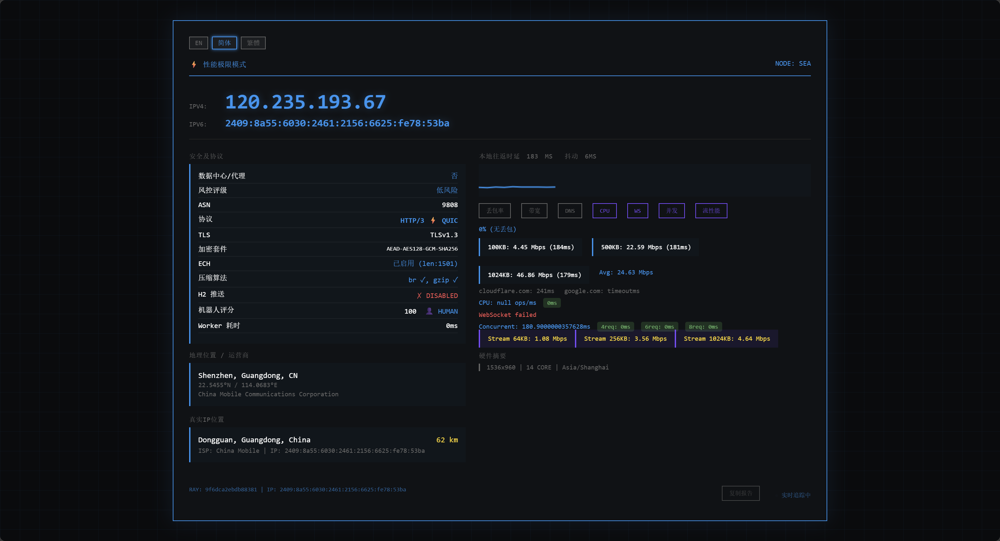

# 🌐 CF-workers-netdiag    ⚡ **享受极致的边缘网络诊断体验！**

> 基于 Cloudflare Workers 的全能网络诊断工具，覆盖延迟、带宽、协议、安全、WebSocket、WASM 等 **20+ 项测试**，一键部署，全球极速可用。

---


---

## ✨ 项目亮点

- ⚡ **20+ 诊断维度**：延迟、抖动、丢包、带宽、DNS、TLS、ECH、Bot 评分、HTTP/2 Push、压缩算法等
- 🧪 **极限性能压测**：CPU 浮点运算、WebAssembly 基准、JavaScript 引擎压力、并发请求、流式吞吐量
- 🌐 **双栈全兼容**：自动获取 IPv4/IPv6 公网地址，服务端查询真实 IP 地理位置（绕过 CDN 代理）
- 📊 **实时 RTT 图表**：Canvas 动态绘制延迟曲线，每 2 秒更新，同时显示抖动 (Jitter)
- 🛡️ **安全风控**：识别数据中心/代理 IP，Cloudflare Bot Score 与风险等级
- 🗣️ **多语言界面**：自动适配 English / 简体中文 / 繁體中文，手动切换偏好记忆
- 📋 **一键复制报告**：将核心网络参数导出为文本，方便分享
- 🚀 **无服务器架构**：完全运行在 Cloudflare Workers 全球边缘节点，毫秒级响应
- 🎨 **终端风格 UI**：深色主题、蓝色主色调、响应式布局、移动端友好

---

## 🖼️ 演示截图



---

## 🚀 快速部署

### 方式一：控制台一键部署（推荐新手）

1. 登录 [Cloudflare Dashboard](https://dash.cloudflare.com/)
2. 进入 **Workers & Pages** → 点击 **创建应用** → **创建 Worker**
3. 为 Worker 命名（例如 `netdiag`），点击 **部署**
4. 点击 **编辑代码**，将本仓库中的 `_worker.js` 全部代码粘贴进去
5. 点击右上角 **保存并部署**，访问你的 Worker 域名即可使用

### 方式二：Wrangler CLI 部署（开发者推荐）

```bash
git clone https://github.com/ASIACOMKHK/CF-workers-netdiag.git
cd CF-workers-netdiag
npm install
npm run dev       # 本地调试（可选）
npm run deploy    # 一键部署到 Cloudflare Workers
```

> 提示：如需使用可选的 KV 缓存，请在 Cloudflare 后台创建 KV 命名空间，并在 Worker 变量中绑定为 `CACHE_KV`。

---

## 🖥️ 诊断面板功能详解

部署后直接访问 Worker 域名即可看到完整终端风格界面，所有测试通过点击按钮触发。

### 基础网络检测
| 测试项 | 说明 |
|--------|------|
| **IPv4 / IPv6** | 自动从多个备用源获取双栈公网地址 |
| **LOCAL RTT** | 每 2 秒向 Worker 发起 HEAD 请求，显示实时往返延迟 |
| **JITTER** | 计算最近 10 次 RTT 的平均抖动 |
| **PACKET LOSS** | 发送 10 个 HEAD 请求，统计丢包百分比 |
| **BANDWIDTH** | 分段下载 100KB/500KB/1MB 随机数据，计算 Mbps 及平均速度 |
| **DNS** | 测试 `cloudflare.com` 与 `google.com` 的解析延迟 |

### 安全与协议分析
| 测试项 | 说明 |
|--------|------|
| **DC / PROXY** | 检测当前 AS 组织是否属于数据中心/代理 |
| **RISK LEVEL** | 根据数据中心判定显示高风险/低风险 |
| **ASN** | 显示自治系统编号及运营商名称 |
| **PROTOCOL** | 自动识别 HTTP/2 或 HTTP/3 (QUIC) |
| **TLS** | 展示 TLS 版本与密码套件 |
| **ECH** | 检测 Encrypted Client Hello 是否启用，显示 Client Hello 长度 |
| **COMPRESSION** | 显示浏览器支持的压缩算法 (Brotli/gzip) |
| **H2 PUSH** | 验证 HTTP/2 Server Push 是否生效 |
| **BOT SCORE** | Cloudflare Bot Management 分配的评分及人类/风险等级 |
| **WORKER TIME** | Worker 处理本次请求的耗时 (ms) |

### 极限性能测试（紫色按钮）
| 测试项 | 说明 |
|--------|------|
| **CPU** | Worker 端执行 50 万次浮点运算，返回 ops/ms 及耗时 |
| **WS** | WebSocket 5 次 ping/pong 测量双向延迟（min/avg/max） |
| **CONCURRENT** | 并发创建 4/6/8 个子请求，展示并发处理时间 |
| **STREAM** | 64KB/256KB/1MB 流式传输吞吐量测试 |
| **DNS RELAY** | 并行查询 Cloudflare DoH 与 Google DoH 的解析延迟 |
| **EDGE** | 并发 ping 5 个全球 Cloudflare 边缘节点 (SFO/LHR/NRT/FRA/IAD) |
| **CACHE** | 测试 Worker Cache API 的 hit/miss 延迟 |
| **WASM** | 内嵌 WebAssembly 模块执行斐波那契计算，返回 ops/s |
| **JS BENCH** | JSON 序列化/正则/排序混合负载，测量 JavaScript 引擎 ops/s |
| **WS ECHO** | 发送 100 条 WebSocket 消息，计算消息吞吐率 (msg/s) |

### 地理与硬件信息
- **LOCATION / ISP**：Cloudflare 检测到的边缘节点城市、经纬度、运营商
- **USER IP LOCATION**：服务端通过 `cf-connecting-ip` 查询真实客户端 IP 的归属地（绕过 CDN 代理）
- **HARDWARE INFO**：屏幕分辨率、CPU 核心数、当前时区

---

## 📡 API 端点（供开发者调用）

以下端点均由 Worker 内部提供，用于支持前端各项测试：

| 路径 | 查询参数 | 说明 |
|------|----------|------|
| `/speedtest` | `size` (默认 102400) | 返回随机二进制数据用于带宽测试 |
| `/cpu-test` | `n` (默认 500000) | Worker CPU 浮点运算压测 |
| `/concurrent-test` | `count`, `size` | 并发子请求性能测试 |
| `/stream-test` | `size` (默认 1048576) | 流式传输测试 |
| `/push-test` | 无 | H2 Server Push 探测 |
| `/doh-compare` | 无 | DNS over HTTPS 对比 |
| `/edge-nodes` | 无 | 返回预设边缘节点列表 |
| `/cache-hit` | 无 | Cache API 命中率测试 |
| `/wasm-test` | 无 | WebAssembly 斐波那契基准 |
| `/js-bench` | 无 | JavaScript 引擎压力测试 |
| `/ws-test` | 无 | WebSocket 端点（支持 `ping` 和 `echo` 命令） |

调用示例：
```bash
# 带宽测试
curl https://你的域名.workers.dev/speedtest?size=524288

# 查看 CPU 基准
curl https://你的域名.workers.dev/cpu-test?n=200000
```

---

## 📁 项目结构

```
CF-workers-netdiag/
├── _worker.js        # Workers 核心代码
├── README.md         # 项目详细文档
├── wrangler.toml     # Wrangler 配置文件
├── LICENSE           # MIT 开源协议
└── screenshot.png    # 项目截图
```

---

## 📌 FAQ

### 1. 为什么真实 IP 位置显示不准确？
工具首先使用 Worker 获取到的真实客户端 IP（`cf-connecting-ip`）并通过 `ip-api.com` 进行查询；若该外部 API 不可用，会降级为前端通过 `ipapi.co` 查询公网出口 IP，由于可能经过代理导致位置偏差。

### 2. 免费套餐够用吗？
Cloudflare Workers 免费方案每日提供 10 万次请求，个人日常诊断完全足够。频繁进行 **带宽/流式/并发/WebSocket 吞吐** 等测试会产生较大流量，请注意配额消耗。

### 3. 如何绑定自己的域名？
在 Cloudflare Workers 控制台 → 触发器 → 添加自定义域名即可。

### 4. 可以增加新的测试吗？
当然可以！你可以在 `_worker.js` 中添加新的路由处理，并扩展前端 HTML 与 i18n 对象。请随意 Fork 仓库并提交 Pull Request。

### 5. 支持私有部署吗？
完全支持。Worker 脚本无外部依赖，可独立运行在任何 Cloudflare 账号下。

---

## 🎯 适用场景

- 个人网络质量快速自检
- 全球边缘节点延迟对比
- CDN/TLS/HTTP 协议兼容性测试
- 前后端开发者调试网络栈
- 学习 Cloudflare Workers 高级特性（WebSocket、Wasm、缓存、并发）
- 技术团队内部工具台

---

## 📄 License

[MIT License](LICENSE) © 2026 ASIACOMKHK

---

## 💬 反馈与贡献

- 问题与建议：[提交 Issues](https://github.com/ASIACOMKHK/CF-workers-netdiag/issues)
- 代码贡献：[Fork & Pull Request](https://github.com/ASIACOMKHK/CF-workers-netdiag/pulls)
