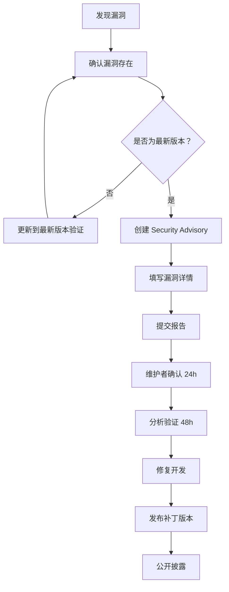

# 🔒 安全政策 | Security Policy

> **NetSight Pro** - 企业级网络安全诊断工具  
> 版本：v3.5 | 最后更新：2026-06-12

---

## 📋 目录

- [安全概览](#-安全概览)
- [安全特性详解](#-安全特性详解)
- [数据安全与隐私](#-数据安全与隐私)
- [第三方服务依赖](#-第三方服务依赖)
- [依赖安全](#-依赖安全)
- [漏洞报告流程](#-漏洞报告流程)
- [安全审计](#-安全审计)
- [合规性与认证](#-合规性与认证)
- [安全最佳实践](#-安全最佳实践)
- [安全更新日志](#-安全更新日志)
- [联系方式](#-联系方式)

---

## 🛡️ 安全概览

NetSight Pro 部署在 **Cloudflare Workers** 边缘节点，采用多层安全防护机制，确保服务稳定运行和用户数据安全。

### 安全等级总览

| 安全维度 | 评分 | 说明 |
| :--- | :---: | :--- |
| 网络安全 | ⭐⭐⭐⭐⭐ | TLS 1.2+ 强制，HSTS 预加载 |
| 应用安全 | ⭐⭐⭐⭐⭐ | CSP 动态 nonce，XSS 完全防护 |
| 数据安全 | ⭐⭐⭐⭐ | 无持久化存储，临时内存存储 |
| 可用性保护 | ⭐⭐⭐⭐⭐ | 限流 + 并发控制 + 参数上限 |
| 隐私保护 | ⭐⭐⭐⭐ | 最小化数据收集，可匿名使用 |

### 安全特性清单

| 安全特性 | 实现状态 | 配置值 | 说明 |
| :--- | :--- | :--- | :--- |
| **请求限流** | ✅ 已实现 | 60次/分钟 | IP 级别限流 |
| **CSP 策略** | ✅ 已实现 | 动态 nonce | 防止 XSS 攻击 |
| **HSTS 强制** | ✅ 已实现 | max-age=31536000 | 强制 HTTPS |
| **XSS 防护** | ✅ 已实现 | 1; mode=block | 浏览器 XSS 过滤器 |
| **点击劫持防护** | ✅ 已实现 | DENY | X-Frame-Options |
| **MIME 类型防护** | ✅ 已实现 | nosniff | 防止 MIME 混淆 |
| **引用来源控制** | ✅ 已实现 | strict-origin-when-cross-origin | Referrer-Policy |
| **参数上限保护** | ✅ 已实现 | 各端点独立 | 防止资源耗尽 |
| **并发限制** | ✅ 已实现 | pLimit(4) | 控制并发任务数 |
| **CORS 控制** | ✅ 已实现 | 严格配置 | 跨域资源共享 |
| **错误处理** | ✅ 已实现 | 不泄露敏感信息 | 优雅降级 |

---

## 🛡️ 安全特性详解

### 1. 请求限流 (Rate Limiting)

**目的**：防止 API 滥用和 DDoS 攻击

**实现机制**：
- 使用内存 `Map` 存储每个 IP 的请求时间戳
- 时间窗口：**60 秒**
- 请求上限：**60 次**
- 清理机制：按需随机抽样清理（约 1% 概率）

**限流配置代码**：
```javascript
// 限流检查
function isRateLimited(ip, maxRequests = 60, windowMs = 60000) {
  const now = Date.now();
  const requests = rateLimit.get(ip) || [];
  const recent = requests.filter(t => now - t < windowMs);
  
  if (recent.length >= maxRequests) return true;
  
  recent.push(now);
  rateLimit.set(ip, recent);
  
  // 随机清理过期记录
  if (rateLimit.size > 0 && Math.random() < 0.01) {
    cleanupRateLimit();
  }
  
  return false;
}
```

**超限响应示例**：
```json
{
  "error": "Too Many Requests",
  "message": "请稍后再试 / Please try again later"
}
```
- HTTP 状态码：`429 Too Many Requests`
- 响应头：`Retry-After: 60`

### 2. 内容安全策略 (CSP)

**目的**：防止 XSS、数据注入、非法资源加载

**策略配置**：
```http
Content-Security-Policy: default-src 'self'; 
  script-src 'self' 'nonce-{random}' https://cdnjs.cloudflare.com https://fonts.googleapis.com; 
  style-src 'self' 'unsafe-inline' https://fonts.googleapis.com; 
  font-src 'self' https://fonts.gstatic.com; 
  connect-src 'self' https://ipapi.co https://api4.ipify.org https://api6.ipify.org; 
  img-src 'self' data:;
```

**策略说明**：
| 指令 | 配置 | 作用 |
| :--- | :--- | :--- |
| `default-src` | `'self'` | 只允许同源资源 |
| `script-src` | `'self'` + 白名单 CDN + nonce | 只允许可信脚本 |
| `style-src` | `'self'` + `'unsafe-inline'` | 允许内联样式 |
| `font-src` | `'self'` + Google Fonts | 只允许可信字体 |
| `connect-src` | `'self'` + 地理服务 API | 只允许可信连接 |
| `img-src` | `'self'` + `data:` | 允许内联图片 |

### 3. HTTP 安全响应头

每个响应都包含以下安全头：

```javascript
const SECURITY_HEADERS = {
  'x-content-type-options': 'nosniff',           // 防止 MIME 嗅探
  'x-frame-options': 'DENY',                     // 防止点击劫持
  'x-xss-protection': '1; mode=block',           // XSS 防护
  'referrer-policy': 'strict-origin-when-cross-origin', // 引用控制
  'strict-transport-security': 'max-age=31536000; includeSubDomains; preload' // HSTS
};
```

**各头详解**：
| 响应头 | 值 | 防护能力 |
| :--- | :--- | :--- |
| `X-Content-Type-Options` | `nosniff` | 防止浏览器根据内容猜测 MIME 类型 |
| `X-Frame-Options` | `DENY` | 完全禁止被嵌入 iframe |
| `X-XSS-Protection` | `1; mode=block` | 检测到 XSS 时阻止页面渲染 |
| `Referrer-Policy` | `strict-origin-when-cross-origin` | 跨域时只发送源信息 |
| `HSTS` | `max-age=31536000; includeSubDomains; preload` | 强制 HTTPS，可预加载 |

### 4. 参数上限保护

为防止资源耗尽攻击（Resource Exhaustion Attack），所有 API 端点都有严格的参数上限：

| 端点 | 参数 | 上限值 | 攻击防护 |
| :--- | :--- | :--- | :--- |
| `/speedtest` | `size` | **5 MB** | 防止超大带宽测试耗尽带宽 |
| `/cpu-test` | `n` | **2,000,000** | 防止无限循环耗尽 CPU |
| `/concurrent-test` | `count` | **16** | 防止过多并发连接 |
| `/concurrent-test` | `size` | **64 KB** | 防止单次请求数据过大 |
| `/stream-test` | `size` | **10 MB** | 防止超大流式传输 |

**代码实现示例**：
```javascript
// 参数上限保护
const size = Math.min(parseInt(url.searchParams.get('size')) || 102400, 5242880); // 最大 5MB
const count = Math.min(parseInt(url.searchParams.get('count')) || 4, 16); // 最大 16
const iterations = Math.min(parseInt(url.searchParams.get('n')) || 500000, 2000000); // 最大 200万
```

### 5. 并发控制

**目的**：防止并发请求过多导致 Worker 资源耗尽

**实现方式**：自定义 `pLimit` 并发限制器

```javascript
// 并发限制器（最大 4 并发）
function pLimit(concurrency) {
  const queue = [];
  let activeCount = 0;
  
  const next = () => {
    activeCount--;
    if (queue.length > 0) {
      const nextFn = queue.shift();
      if (nextFn) nextFn();
    }
  };
  
  const run = async (fn, resolve, reject) => {
    activeCount++;
    try {
      const result = await fn();
      resolve(result);
    } catch (error) {
      reject(error);
    } finally {
      next();
    }
  };
  
  return (fn) => new Promise((resolve, reject) => {
    queue.push(() => run(fn, resolve, reject));
    if (activeCount < concurrency && queue.length > 0) {
      const nextFn = queue.shift();
      if (nextFn) nextFn();
    }
  });
}

// 使用示例
const limit = pLimit(4);
```

### 6. CORS 控制

**配置**：
```javascript
const CORS_HEADERS = {
  'access-control-allow-origin': '*',
  'access-control-allow-methods': 'GET, HEAD, OPTIONS',
  'access-control-allow-headers': 'Content-Type',
  'access-control-max-age': '86400',
  'cache-control': 'no-store',
  'vary': 'Origin'
};
```

### 7. 输入验证与输出编码

**输入验证**：
- 所有 URL 参数进行类型检查
- 使用 `Math.min()` 限制参数范围
- 无效参数使用默认值

**输出编码**：
```javascript
function escapeForJS(str) {
  if (str === null || str === undefined) return '';
  return String(str)
    .replace(/\\/g, '\\\\')
    .replace(/'/g, "\\'")
    .replace(/"/g, '\\"')
    .replace(/\n/g, '\\n')
    .replace(/\r/g, '\\r')
    .replace(/\t/g, '\\t');
}
```

### 8. 错误处理

- 所有异步操作都有 try-catch 包裹
- 错误信息不泄露敏感数据
- 优雅降级，返回通用错误响应

---

## 🔐 数据安全与隐私

### 数据收集声明

NetSight Pro **最小化**数据收集，仅临时存储必要信息：

| 数据类型 | 是否收集 | 存储位置 | 保留时间 | 用途 |
| :--- | :--- | :--- | :--- | :--- |
| 客户端 IP 地址 | ✅ 临时 | 内存 (Map) | 60 秒 | 限流、地理位置查询 |
| 请求时间戳 | ✅ 临时 | 内存 (Map) | 60 秒 | 限流计算 |
| 请求路径 | ✅ 临时 | Worker 日志 | 无持久化 | 调试 |
| User-Agent | ✅ 临时 | 请求头 | 无持久化 | 诊断展示 |
| 地理位置信息 | ✅ 临时 | 变量 | 请求结束即清除 | 展示边缘节点位置 |
| TLS 连接信息 | ✅ 临时 | `request.cf` 对象 | 请求结束即清除 | 协议检测展示 |
| 用户诊断数据 | ❌ 不收集 | - | - | - |
| Cookie | ❌ 不收集 | - | - | - |
| Session | ❌ 不存储 | - | - | - |

### 数据流转图

```
用户请求 → Cloudflare Worker
    ↓
限流检查（内存存储 IP + 时间戳，60秒后自动清理）
    ↓
处理请求（可能调用外部 API 获取地理位置）
    ↓
返回响应（不存储任何用户数据）
    ↓
内存释放（请求结束）
```

### 隐私保护措施

1. **无持久化存储**：不写入数据库、文件系统或 KV 存储
2. **自动清理**：限流数据 60 秒后自动过期
3. **最小化收集**：只收集功能必需的 IP 地址
4. **可匿名使用**：不要求用户登录或提供任何个人信息
5. **第三方限制**：外部 API 调用只发送必要信息

---

## 🌐 第三方服务依赖

NetSight Pro 依赖以下第三方服务，所有服务均通过 HTTPS 加密通信：

| 服务 | 用途 | 发送数据 | 隐私政策 |
| :--- | :--- | :--- | :--- |
| **ip-api.com** | 客户端 IP 地理位置查询 | IP 地址 | [隐私政策](https://ip-api.com/legal#privacy) |
| **ipify.org** | 客户端公网 IP 检测 | 无（IP 由服务端获取） | [隐私政策](https://www.ipify.org/privacy) |
| **Cloudflare** | 边缘计算平台 | 请求元数据 | [隐私政策](https://www.cloudflare.com/privacypolicy/) |
| **cdnjs.cloudflare.com** | Font Awesome 图标库 | 无（静态资源） | [隐私政策](https://cdnjs.com/privacy) |
| **fonts.googleapis.com** | Google Fonts 字体 | IP 地址 | [隐私政策](https://policies.google.com/privacy) |
| **fonts.gstatic.com** | Google Fonts 字体文件 | IP 地址 | [隐私政策](https://policies.google.com/privacy) |

### 第三方服务停用

如果希望完全禁用第三方服务：
- **地理位置查询**：修改代码跳过 `ip-api.com` 调用
- **CDN 资源**：下载静态资源到本地托管

---

## 📦 依赖安全

### 外部依赖清单

| 依赖 | 版本 | 类型 | 风险等级 | 说明 |
| :--- | :--- | :--- | :--- | :--- |
| Cloudflare Workers Runtime | 2024-12-01 | 运行时 | ✅ 低 | 由 Cloudflare 维护 |
| Font Awesome | 6.4.0 | CDN | ✅ 低 | 只读静态资源 |
| Google Fonts (Inter) | - | CDN | ✅ 低 | 只读静态资源 |

### 供应链安全声明

- ✅ **零 npm 依赖**：项目是单文件 Worker，无任何 npm 包
- ✅ **零 Python 依赖**：无需 Python 环境
- ✅ **零系统依赖**：纯 JavaScript 运行
- ✅ **SRI 建议**：建议为 CDN 资源添加 Subresource Integrity

### 建议的 SRI 配置

```html
<link rel="stylesheet" href="https://cdnjs.cloudflare.com/ajax/libs/font-awesome/6.4.0/css/all.min.css"
      integrity="sha512-iecdLmaskl7CVkqkXNQ/ZH/XLlvWZOJyj7Yy7tcenmpD1ypASozpmT/E0iPtmFIB46ZmdtAc9eNBvH0H/ZpiBw=="
      crossorigin="anonymous" referrerpolicy="no-referrer" />
```

---

## 🚨 漏洞报告流程

### 报告渠道

| 渠道 | 链接/方式 | 响应时间 | 加密支持 |
| :--- | :--- | :--- | :--- |
| **GitHub Security Advisory** | [创建安全通告](https://github.com/BlueDriftHK/CF-workers-netdiag/security/advisories/new) | 24 小时内 | ✅ 支持 |
| **GitHub Issues** | [公开 Issue](https://github.com/BlueDriftHK/CF-workers-netdiag/issues) | 48 小时内 | ❌ 公开 |
| **GitHub Discussions** | [私密讨论](https://github.com/BlueDriftHK/CF-workers-netdiag/discussions) | 48 小时内 | ⚠️ 有限 |

### 报告流程



### 报告要求

请提供以下信息：

```markdown
## 漏洞报告模板

### 基本信息
- **漏洞类型**： [如：XSS / 限流绕过 / 信息泄露]
- **影响版本**： [如：v3.3 - v3.5]
- **严重程度**： [严重 / 高 / 中 / 低]

### 漏洞描述
[详细描述漏洞情况]

### 复现步骤
1. [第一步]
2. [第二步]
3. [第三步]

### 预期行为 vs 实际行为
- **预期**：[描述]
- **实际**：[描述]

### 影响范围
[受影响的功能或用户范围]

### 修复建议
[可选的修复方案]

### 附件
[截图、日志、代码片段等]
```

### 漏洞披露政策

| 阶段 | 时间 | 动作 |
| :--- | :--- | :--- |
| 接收报告 | 0-24h | 确认收到并分配严重等级 |
| 分析确认 | 24-72h | 验证漏洞并评估影响 |
| 修复开发 | 72h-7d | 开发补丁并内部测试 |
| 发布更新 | 7-14d | 发布补丁版本 |
| 公开披露 | 修复后 30d | 公开漏洞详情 |

---

## 📊 安全审计

### 审计状态

| 审计类型 | 状态 | 最后审计 | 审计方 | 结果 |
| :--- | :--- | :--- | :--- | :--- |
| 代码安全审计 | ✅ 已完成 | 2026-06-11 | 内部 | 通过 |
| 依赖审计 | ✅ 已完成 | 2026-06-11 | 内部 | 无风险 |
| CSP 策略审计 | ✅ 已完成 | 2026-06-11 | 内部 | 有效 |
| 限流有效性测试 | ✅ 已完成 | 2026-06-11 | 内部 | 有效 |
| 渗透测试 | ⚠️ 计划中 | - | 待定 | - |
| 第三方安全审计 | ⚠️ 计划中 | - | 待定 | - |

### 自我审计清单

```markdown
## 安全审计清单

### 输入验证
- [x] 所有 URL 参数有类型检查
- [x] 所有参数有上限限制
- [x] 无效参数使用默认值

### 输出编码
- [x] HTML 输出使用 escapeForJS 转义
- [x] JSON 响应使用 JSON.stringify

### 认证与授权
- [x] 无需认证（公开工具设计）
- [x] 限流机制作为访问控制

### 加密与传输
- [x] TLS 1.2+ 强制
- [x] HSTS 预加载配置
- [x] 无敏感数据明文传输

### 日志与监控
- [x] Worker 日志可追踪
- [x] 限流事件可观测
- [x] 不记录敏感信息

### 错误处理
- [x] 异常有 try-catch 包裹
- [x] 错误信息不泄露内部细节
- [x] 优雅降级响应

### 会话管理
- [x] 无状态设计
- [x] 不存储 Session
- [x] 不设置 Cookie
```

---

## 📜 合规性与认证

### 合规性说明

| 标准/法规 | 合规状态 | 说明 |
| :--- | :--- | :--- |
| **GDPR** | ✅ 合规 | 最小化数据收集，不存储个人数据 |
| **CCPA** | ✅ 合规 | 无数据销售，可匿名使用 |
| **PCI DSS** | ✅ 不适用 | 不处理支付信息 |
| **HIPAA** | ✅ 不适用 | 不处理医疗信息 |
| **SOC 2** | ⚠️ 待认证 | 计划中 |

### GDPR 合规措施

- **数据最小化**：只收集 IP 地址（限流必需）
- **存储限制**：数据 60 秒后自动删除
- **目的限制**：只用于限流和地理位置展示
- **透明度**：本政策明确说明数据使用
- **用户权利**：无需注册，不存储个人数据

---

## ✅ 安全最佳实践

### 部署者安全建议

#### 1. 保持更新
```bash
# 定期拉取最新版本
git pull origin main

# 重新部署
wrangler deploy --main _workers.js
```

#### 2. 自定义限流阈值

```javascript
// 更严格的限制（30次/分钟）
if (isRateLimited(clientIp, 30)) { ... }

// 更宽松的限制（100次/分钟）
if (isRateLimited(clientIp, 100)) { ... }

// 不同的时间窗口（30次/10秒）
if (isRateLimited(clientIp, 30, 10000)) { ... }
```

#### 3. 启用 KV 缓存

```toml
kv_namespaces = [
  { binding = "CACHE_KV", id = "your-kv-namespace-id" }
]
```

#### 4. 监控 Worker 日志

```bash
# 实时监控
wrangler tail

# 过滤错误
wrangler tail --filter "status:>=400"
```

### 用户安全建议

1. **使用 HTTPS**：始终通过 HTTPS 访问服务
2. **验证证书**：确认 SSL/TLS 证书有效
3. **注意隐私**：诊断报告包含 IP 信息，谨慎分享
4. **报告问题**：发现异常及时报告

### 安全测试命令

```bash
# 测试限流
for i in {1..70}; do curl -s -o /dev/null -w "%{http_code}\n" https://your-worker.dev/health; done

# 测试参数上限
curl "https://your-worker.dev/speedtest?size=99999999"

# 测试 CSP
curl -I https://your-worker.dev/ | grep -i "content-security-policy"
```

---

## 📋 安全更新日志

### v3.5 (2026-06-11)

**安全改进**：
- ✨ **限流清理优化**：从 `setInterval` 改为按需随机抽样清理
- 🔒 **CSP 增强**：使用动态 nonce，提升 XSS 防护强度
- 🐛 **安全修复**：修复全局作用域异步操作的潜在竞态条件
- 💓 **WebSocket 安全**：增强心跳机制，防止空闲连接超时

### v3.3 (2026-05-28)

**安全新增**：
- ✨ **请求限流**：IP 级别 60次/分钟限流保护
- ✨ **安全响应头**：完整添加 CSP、HSTS、X-Frame-Options 等
- ✨ **健康检查端点**：`/health` 支持监控集成
- 🛡️ **并发控制**：新增 `pLimit(4)` 防止资源耗尽
- ⚡ **参数上限**：所有测试端点增加上限保护

### v3.0 (2026-05-10)

**安全基础**：
- ✨ 初始安全框架搭建
- 🔒 基础 TLS 强制
- 🛡️ 基础输入验证

---

## 📞 联系方式

| 用途 | 渠道 | 响应时间 |
| :--- | :--- | :--- |
| **紧急安全漏洞** | GitHub Security Advisory | 24 小时 |
| **一般安全问题** | [GitHub Issues](https://github.com/BlueDriftHK/CF-workers-netdiag/issues) | 48 小时 |
| **安全讨论** | [GitHub Discussions](https://github.com/BlueDriftHK/CF-workers-netdiag/discussions) | 48 小时 |

---

## 📄 文档信息

| 属性 | 值 |
| :--- | :--- |
| **文档版本** | 1.0 |
| **最后更新** | 2026-06-12 |
| **适用于版本** | v3.5+ |
| **维护者** | [BlueDriftHK](https://github.com/BlueDriftHK) |
| **许可证** | GPL-3.0 |

---

**Made with ❤️ by BlueDriftHK**

**保持警惕，共同守护网络安全**

---

[⬆️ 返回顶部](#-安全政策--security-policy)
